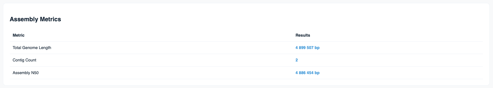
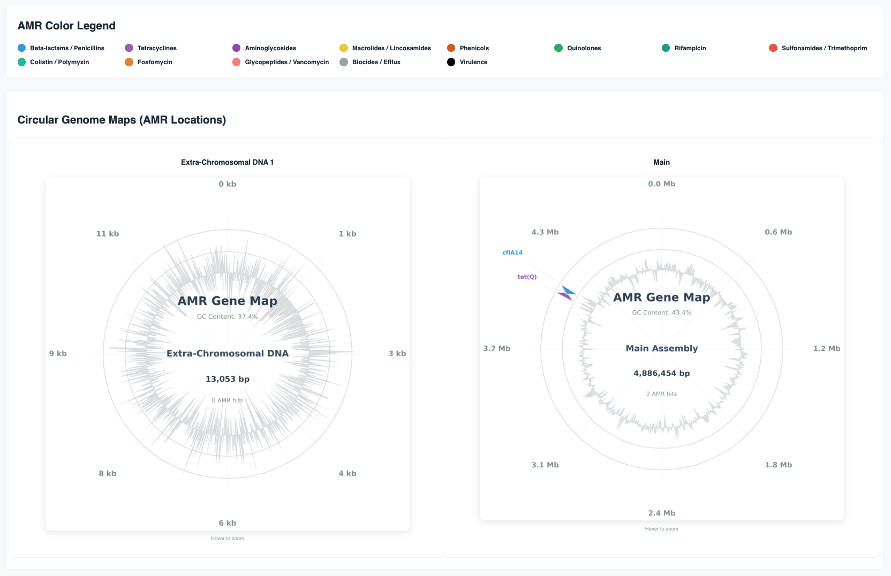

# MOSTAR - Modular ONT-Short-read Taxonomic Assembly and Resistance pipeline

  

### 
MOSTAR is a comprehensive bioinformatics pipeline designed to bridge the gap between long-read structural continuity and short-read base-pair accuracy. The name Mostar is inspired by the historic Stari Most (Old Bridge) of Mostar, a symbol of connection and cultural resilience. By integrating Oxford Nanopore Technologies (ONT) with Illumina sequencing, the pipeline reconstructs highly polished bacterial genomes. It performs hybrid and long-read assemblies, polishing, functional annotation, AMR profiling, and taxonomic classification — with built-in quality controls and an interactive HTML report. The pipeline has been developed and tested with and without short reads on *S. aureus*, *B. fragilis*, as well as *H. influenzae* strains, but will work with any bacteria, as long as the correct genome size and ONT model are specified. The pipeline can run both in hybrid-mode, as well as ONT-only; the optimal mode is automatically selected based on user-input. 

Note: Some settings are hard-coded in the initial release, however several of the key arguemnts are available to fine-tune the pipeline (see below). 

# Interactive HTML-report 
### Species ID and QC-metrics for assembly

  

### QC-Metrics for assembly

  

### Circular Genome visualization including interactive zoom

  

### AMR+ Summary Table

  

### ONT-only mode:
1. Long-read quality trimming: Filtlong 
2. De-novo assembly: Flye
3. Long-read consensus correction: Medaka
4. Taxonomic profiling: EMU &/or Kraken2 
6. Functional annotation: BAKTA 
7. AMR: NCBI AMRFinder+ 
8. Report: Complete report in HTML-format

### Hybrid mode - In addition to the stepps above, the pipeline can also include
1. Short-read quality trimming: FastP for adapter & QC trimming
2. Mapping short reads to conesensus: BWA 
3. Polishing: Polypolish for hybrid polishing using supplied short-reads

### Html-report
The provided report will display the most usefull statistics, depending on run mode.
1. Run parameters - Time & date, sample name, as well as total runtime
2. Kraken2 - species ID
3. EMU Taxonmy
4. EMU Abundance 
5. Assembly Quality Metrics
6. Circular Genome visualization including AMR-genes and direction
7. Table containing detailed AMR report
8. Software information

### Requirements and input files
<pre>
# In its simplest form, MOSTAR requires only 
1. ONT-reads 
2  Expected genome size 
3. Correct model (Default: r1041_e82_400bps_sup_v5.2.0)
4. Output folder 

# Run Mostar in Hybrid mode: 
mostar --ont ont.fq.gz -g [size] -o [dir]  --r1 R1.fq --r2 R2.fq

# Include Kraken2 & EMU taxonomy, annotation with Bakta, and specify organism for AMRFinder+ (if supported, otherwise leave empty)
# Remember to change (--genome-size), (--model) and (--organism), this will tailor the algortihm to your data. 
# Example using Haemophilus influenzae

mostar --ont ont_read.fastq.gz --r1 read1.fastq.gz --r2 read2.fastq.gz -g 2.1m --output Output -a L42023.1.gb --organism Haemophilus_influenzae --emu-db ./emu_db -m r1041_e82_400bps_sup_v5.2.0 

# To run the pipeline in ONT-only mode, just omit read1/read2. 
# ONT-only mode:
mostar --ont ont.fq.gz --genome-size [size] -output [dir] 

</pre>

### Output files
A successfull run wil contain the following, including the final polished fasta and html-report.
<pre>
  Output_folder
  |- amr_results
  |- annotation
  |- flye
  |- intermediate
  |- logs
  |- medaka
  |- MOSTAR_Assembly.fasta
  |- MOSTAR_Final_Report.html
  |- taxonomy
</pre>

# Packages & Dependencies (installed by yml)
<pre>
1. Fastp
2. Flye
3. Medaka
4. BWA 
5. AMRFinder+
6. PROKKA
7. Polypolish
8. Filtlong
9. Samtools
10. Minimap2
11. Kraken2
12. EMU
</pre>  

# Installation (Conda or Mamba)
<pre>
# Clone the repository:
git clone https://github.com/nermze/MOSTAR.git

# Change dir:
cd MOSTAR

# Create a conda env with all dependencies from the provided yml:
conda env create -f environment.yml

# Activate the environment:
conda activate mostar-env

# Install using pip:
pip install . 

### Manually download databases###

# Download AMRFinder+ database: 
conda activate mostar-env (if not activated)
amrfinder -u

# Download standard EMU database
# The pipeline will auto-download the EMU-db if --emu-db is specified.
# If the automatic download fails, use the steps below
pip install osfclient
export EMU_DATABASE_DIR=<path_to_database>
cd ${EMU_DATABASE_DIR}
osf -p 56uf7 fetch osfstorage/emu-prebuilt/emu.tar
tar -xvf emu.tar

# Download Kraken2 database
# To download the small pre-built db (any Kraken2 compatible DB will also work)
mkdir -p ~/kraken2_db && cd ~/kraken2_db
wget https://genome-idx.s3.amazonaws.com/kraken/k2_pluspf_08gb_20240904.tar.gz
tar -xvzf k2_pluspf_08gb_20240904.tar.gz

</pre>

# Apple Silicone Users:
<pre>
Please create the environment using Intel-emulation (Rosetta 2) before install:
  
CONDA_SUBDIR=osx-64 conda env create -f environment.yml
conda activate mostar_env
conda config --env --set subdir osx-64
</pre>

### Command-Line Arguments
| Required | Tool/Name| Description |
| :--- | :--- | :--- |
| `--ont` | ONT Reads | Nanopore long-reads (.fastq.gz) |
| `--genome-size` | Genome Size | Estimated size (e.g., 2.1m) |
| `--outoput` | Output | Directory name for output files |
| `--model` | Model | Default: r1041_e82_400bps_sup_v5.2.0) |
| Options | |
| `--r1/--r2` | Illumina | Forward & Reverse short-reads (.fastq.gz) |
| `--organism` | AMRFinder+ | Organism (e.g., Escherichia, Staphylococcus) |
| `--filtlong-cov` | Filtlong | Target coverage (Default:100) |
| `--meta` | Flye | Enable Meta-Genome mode, omit --genome-size [Default: disabled] |
| Annotation | |
| `--bakta-db` | Bakta | Path to Bakta database |
| `--bakta-ref` | Bakta | Annotation reference sequence (.gff) |
| `--complete` | Bakta | Enable if sequence is complete (circular) [Default: disabled] |
| Classification | |
| `--kraken-db` | Kraken2 | Requires path to pre-built Kraken2 database" |
| `--confidence` | Kraken2 | Kraken2 confidence threshold [Default: 0.1 |
| `--emu-db` | EMU | Requires EMU database path, auto-download [16s Amplicon classifier] |
| Other | |
| `--cleanup` | Cleanup | Delete intermediate files |
| `--threads` | Threads | Select number of threads |
| `--help/-h` | Help | Show help menu|

# Troubleshooting and known issues
Q: My assembly is poor
A: You have to specify the correct expected genome size (--genome-size) and model example r1041.XX (--model)

Q: My assembly is still failing
A: Your input data might be too low quailty. Try reducing --filtlong-cov.  

Q: Where are my plasmids?
A Try running with --meta 

Q: Im getting an index-error during assembly with Flye
A: You are using the same output folder from a previous run. Please specify a new output folder with (--output), or rename/move/delete the old one. 

Q. My exact model is not accepted 
A. you may need to downgrade medaka or install a specific version. You can do this by typing: conda install -c bioconda medaka=your_version, example medaka=2.2.0 

# Maintainer and author

Developed and maintained by **Nermin Zecic** ([@nermze](https://github.com/nermze)). 
For questions, bugs, or feature requests, please open an [Issue](https://github.com/nermze/mostar/issues).
