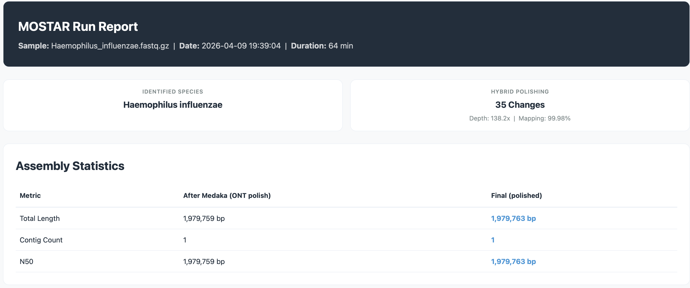
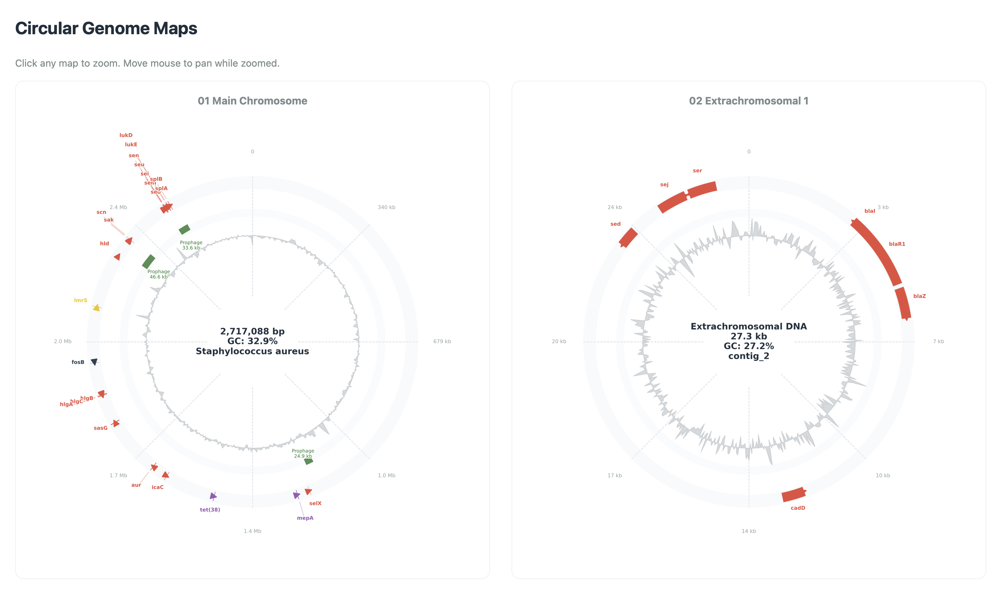
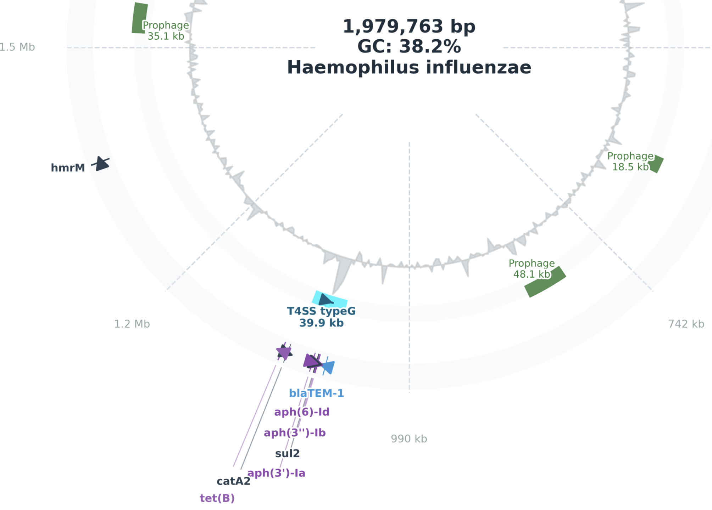
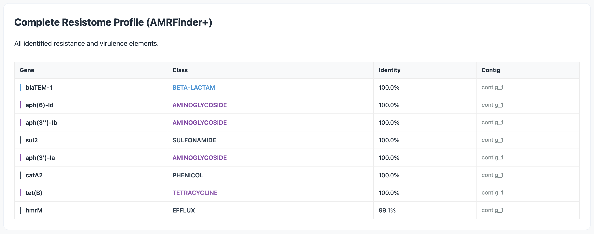

# MOSTAR - Modular ONT-Short-read Taxonomic Assembly and Resistome-Evolution pipeline
<p align="center">
  
</p>

<p align="center">
  
  
  
  
  
  
  
  
</p>

MOSTAR is comprehensive and complete bioinformatics pipeline for downstream analysis of whole-genome Oxford Nanopore sequencing data (ONT-reads). The pipeline constructs highly-polished genomes (using hybrid- or non-hybrid assembly), in addition to performing functional annotation, AMR profiling, ICE detection, and taxonomic classification — with built-in quality controls and an interactive HTML report. The name Mostar is inspired by the historic Stari Most (Old Bridge) of Mostar, a symbol of connection and cultural resilience.  

MOSTAR has been developed and tested on *S. aureus*, *B. fragilis*, as well as *H. influenzae* strains, but will work with any bacteria, as long as the correct genome size and ONT model are specified. The pipeline contains some of the most well known tools in bioinformatics, and is designed to be a "one-stop shop" for most bacterial analysis. Finally the pipeline provides results and log files from every included tool. 

# Key features

### Hybrid-Informed Quality Control
When Illumina short reads are provided, MOSTAR leverages them during the long-read pre-processing phase to guide Filtlong in selecting ONT reads with the highest k-mer consistency relative to the high-accuracy short-read data. This ensures the assembly begins with the most reliable and representative long-read subset, directly improving contiguity and reducing the introduction of systematic errors before assembly begins. In ONT-only mode, quality filtering proceeds using read length and quality score thresholds without short-read guidance.

### Adaptive Assembly and Polishing
MOSTAR supports both ONT-only and hybrid assembly modes through a tiered polishing strategy. All assemblies undergo ONT-based polishing with Medaka to correct homopolymer errors and indels characteristic of nanopore sequencing. In hybrid mode, a second polishing pass with Polypolish uses per-read, multi-alignment short-read mappings to further resolve errors in repeat regions that single-mapping approaches cannot correct.

### Comprehensive Genomic Profiling
MOSTAR provides an end-to-end biological characterisation of each assembled genome within a single run. It automatically identifies the organism to species or subspecies level via Kraken2, profiles the complete resistome with NCBI AMRFinder+, and evaluates genomic plasticity through geNomad plasmid and provirus detection. The pipeline optionally performs full functional annotation via Bakta, enabling downstream comparative genomics and submission-ready genome records.

### Integrated Mobilome and Resistance Cross-Referencing
By tightly integrating NCBI AMRFinder+ with MacSyFinder CONJScan, MOSTAR cross-references the physical location of resistance genes with conjugative transfer machinery. This allows the pipeline to distinguish between fixed chromosomal resistance — which poses a contained clinical risk — and resistance elements embedded within active Integrative and Conjugative Elements (ICEs), which are capable of horizontal transfer to naive recipient strains. This distinction provides a substantially more accurate assessment of horizontal gene transfer potential and the true epidemiological threat posed by the isolate.

### ICE Detection and Structural Annotation
MOSTAR includes dedicated detection of Integrative and Conjugative Elements using MacSyFinder with the CONJScan model database. ICE boundaries are resolved to exact genomic coordinates and cross-referenced against the Bakta functional annotation to identify flanking genes, attachment sites, and associated cargo. Detected ICEs are rendered directly on the circular genome map with strand-aware orientation arrows, providing immediate visual context for their genomic position relative to resistance and virulence loci.

### Self-Contained Interactive HTML Report
Every MOSTAR run produces a single, portable HTML report requiring no server or external dependencies. The report includes circular genome maps with zoomable, cursor-tracked pan functionality, a colour-coded complete resistome table, prophage annotations, mobile resistome cross-reference, and a full software version manifest for reproducibility. All genome maps are embedded as base64-encoded images, ensuring the report remains fully self-contained for sharing and archiving.

### MOSTAR - Workflow and run-modes 
<p align="left">
  <div align="left" style="background-color: white; padding: 25px; border-radius: 10px;">
    
  </div>
</p>

#### ONT-only mode:
* Long-read quality trimming 
* De-novo assembly
* Long-read consensus correction
* AMR profiling
* Report

#### Hybrid mode - Additional steps if short-reads are provided:
* Short-read quality trimming
* Mapping short reads to consensus
* Polishing using supplied short-reads

#### Optional tools
* Taxonomic profiling  
* Functional annotation
* Integrative and Conjugative Elements (ICEs)

#### Output files
A successful run will contain the following output, including the final polished fasta, HTML-report, as well as individual output files and logs from all the included tools. 
<pre>
  Output_folder
  |- amr_results
  |  |- maps/ (Contains high-res .png circular genome maps)
  |  |- AMR_Report.tsv
  |- annotation
  |- flye
  |- ice_detection
  |- annotation
  |- flye
  |- ice_detection
  |- intermediate
  |- logs
  |- medaka
  |- taxonomy
  |- amr_summary.html
  |- MOSTAR_Final_Report.html
  |- MOSTAR_Assembly.fasta
</pre>

### Installation (Conda)
The installation has been designed to be as simple as possible. The included YML will create a separate environment with all the required dependencies. The only manual step is downloading and configuring databases. For some systems geNomad may become a dependency issue, it is therefor recommended to install it following the steps below. 

```bash
# Install micromamba for speed
conda install micromamba

# Download the repository
git clone https://github.com/nermze/mostar.git

# Change to MOSTAR dir
cd mostar

# Create env and install using micromamba
micromamba env create -f environment.yml -v
micromamba activate mostar_env

# To avoid depedency issues, install geNomad separatly
micromamba install -c conda-forge -c bioconda genomad

# Test the install
mostar --help
```

#### Setup and download Databases
```bash 
# Activate env (if not activated)
conda activate mostar-env 
  
# Download AMRFinder+ database: 
amrfinder -u

# Download bakta database (Specify light or full)
bakta_db download --output <output-path> --type [light|full]

# Download Kraken2 database
# To download the small pre-built db (any Kraken2 compatible DB will also work)
mkdir -p ~/kraken2_db && cd ~/kraken2_db
wget https://genome-idx.s3.amazonaws.com/kraken/k2_pluspf_08gb_20240904.tar.gz
tar -xvzf k2_pluspf_08gb_20240904.tar.gz

# Download geNomad database in current directory, approx 1.5Gb 
genomad download-database .
  
# Download standard EMU database
# The pipeline will auto-download the EMU-db if --emu-db is specified.
# If the automatic download fails, use the steps below
pip install osfclient
export EMU_DATABASE_DIR=<path_to_database>
cd ${EMU_DATABASE_DIR}
osf -p 56uf7 fetch osfstorage/emu-prebuilt/emu.tar
tar -xvf emu.tar
```

### Usage instructions & input files
```bash
# Required:
* ONT-reads
* Genome size 
* Model
* Output
  
# Run MOSTAR in ONT-only mode: 
mostar --ont ont.fq.gz --genome-size [size] --output [dir] --model [model]

# Run MOSTAR in Hybrid mode:  
mostar --ont ont.fq.gz --genome-size [size] --output [dir] --model [model] --r1 R1.fq --r2 R2.fq 
  
# The "Everything" Run (Taxonomy, Annotation, ICE, and Plasticity/Prophages):
mostar --ont ont_read.fastq.gz --r1 read1.fastq.gz --r2 read2.fastq.gz \
  --genome-size 1.9m --output Output \
  --kraken2-db kraken2_db_path \
  --bakta-db db-light_path --ice \
  --genomad-db genomad_db_path --plasticity
```

### Command-Line Arguments
|   Required   |   Tool/Name  | Description |
| :-------| :---------| :--- |
| `--ont` | ONT Reads | Nanopore long-reads (.fastq.gz) |
| `--genome-size`  | Genome Size   | Estimated size (e.g., 2.1m, 500k) |
| `--output` | Output | Directory name for output files |
| `--model` | Model | Default: r1041_e82_400bps_sup_v5.2.0) |
| Options | |
| `--r1/--r2` | Illumina | Forward & Reverse short-reads (.fastq.gz) |
| `--organism` | AMRFinder+ | Organism (e.g., Escherichia, Staphylococcus) |
| `--meta` | Flye | Enable Meta-Genome mode, omit --genome-size [Default: disabled] |
| Annotation | |
| `--bakta-db` | Bakta | Path to Bakta database |
| `--bakta-ref` | Bakta | Annotation reference sequence (.gff) |
| `--complete` | Bakta | Enable if sequence is complete (circular) [Default: disabled] |
| Mobile element Detection | |
| `--ice` | MacSyFinder | Use with --bakta-db [Default: disabled] |
| `--plasticity` | geNomad | Plasticity and prophage tracker [Default: disabled] |
| Classification | |
| `--kraken2-db` | Kraken2 | Requires path to pre-built Kraken2 database" |
| `--confidence` | Kraken2 | Kraken2 confidence threshold [Default: 0.1 |
| `--emu-db` | EMU | Requires EMU database path, auto-download [16s Amplicon classifier] |
| Other | |
| `--cleanup` | Cleanup | Delete intermediate files |
| `--threads` | Threads | Select number of threads |
| `--help/-h` | Help | Show help menu|
  

# Interactive HTML-report 
#### Species ID and QC-metrics for assembly
The report features key run-metrics, including assembly statistics and number of contigs. The report is dynamic and will adapt to user input, as some of the tools like taxonomy and short-read polishing are optional.  
<p align="left">
  
</p>

#### Genome visualization
The report will also draw interactive genome maps, with visualizagion of AMR-gene locations, direction, detected ICE, and GC-content. 
<p align="left">
  
</p>

#### Integrative Conjugative Elements (ICE)
If ICE detection has been enabled, the pipeline will extract coordinates from the annotation file, and display the results. 
<p align="left">
  
</p>

#### AMR+ Summary Table
Finaly the report willl also feature a detailed AMR table.  
<p align="left">
  
</p>


# Packages & Dependencies (installed by yml)
<pre>
1. Fastp
2. Flye
3. Medaka
4. BWA 
5. AMRFinder+
6. Bakta
7. Polypolish
8. Filtlong
9. Samtools
10. Minimap2
11. Kraken2
12. EMU
13. MacSyFinder 
14. geNomad
15. Python3 (
</pre>  


# Troubleshooting, known issues & tips
#### Medaka Model Selection
If --model is not specified, MOSTAR defaults to r1041_e82_400bps_sup_v5.2.0, which corresponds to R10.4.1 flowcells basecalled with the Super Accuracy model at 400 bps. This default is appropriate for most modern ONT runs but must be changed if your data was generated on a different flowcell or basecalling configuration — using the wrong model is one of the most common causes of poor polishing outcomes. To list all models available in your Medaka installation, run: hmedaka tools list_models

#### ICE Detection Requires Functional Annotation
The --ice module depends on protein sequences produced by Bakta to query the MacSyFinder CONJScan database. If --bakta-db is not provided, Bakta annotation is skipped and no .faa file will be produced, causing ICE detection to be silently bypassed. Always pair --ice with --bakta-db to ensure this module runs. If you see the warning No protein file found — skipping ICE detection, this is the cause.

#### Taxonomic Classification and AMRFinder+ Point Mutation Models
When --kraken2-db is provided, MOSTAR uses the top-confidence Kraken2 hit to identify the organism and passes it to AMRFinder+ as the --organism flag, enabling species-specific point mutation screening in addition to gene-based resistance detection. Point mutation models are only available for a subset of clinically relevant organisms. If your organism is not supported, AMRFinder+ will still run in gene-detection mode without point mutations. To see all supported organisms, run: amrfinder --list_organisms
If you know your organism and want to override automatic detection, or if you are running without a Kraken2 database, use: --organism Klebsiella
Leave --organism unset if the organism is unknown — AMRFinder+ will still provide a complete gene-level resistome profile.

#### Uneven Coverage and Metagenome-like Assemblies
If your assembly is fragmented, missing expected genomic features, or producing an unusually high contig count, your sample may have uneven read depth — common in direct clinical extractions, environmental samples, mixed cultures, or plasmid-enriched preps. Re-run with the --meta flag to enable Flye's uneven-coverage assembly mode, which does not assume uniform depth across the genome: mostar --ont reads.fq.gz --genome-size 5m --output outdir --meta
Note that --meta mode disables some of Flye's coverage-based error correction, so it should only be used when standard assembly fails or produces poor results.

#### Low Polypolish Coverage in Hybrid Mode
If the hybrid polishing step reports mean read depth: 0.0x across all contigs, your Illumina reads are likely incomplete, truncated, or mismatched to the assembly. Verify your R1/R2 files are complete and correctly paired before re-running. MOSTAR validates that these files exist and are non-empty at startup, but cannot detect partially downloaded or corrupted files. Check read counts with: hecho $(( $(wc -l < R1.fastq) / 4 )) reads
A genome of ~5 Mb requires approximately 500,000 paired reads at 100 bp for 10× Polypolish coverage.

#### Output Directory Conflicts
If the specified --output directory already exists from a previous run, MOSTAR will write into it and overwrite existing files without warning. If you want to preserve a previous result, rename the output directory before re-running or specify a new output path.

#### Assembly Statistics Show Identical Medaka and Final Values
In hybrid mode, if the Medaka and Final assembly statistics are identical, Polypolish ran but made no changes. This is expected when short-read coverage is very low (typically below 5×) and does not indicate an error. Check logs/polypolish.log to confirm — the mean read depth per contig will be reported there.

# Maintainer and author
[](https://github.com/nermze)

Developed and maintained by **Nermin Zecic** ([@nermze](https://github.com/nermze)). 
For questions, bugs, or feature requests, please open an [Issue](https://github.com/nermze/mostar/issues).
