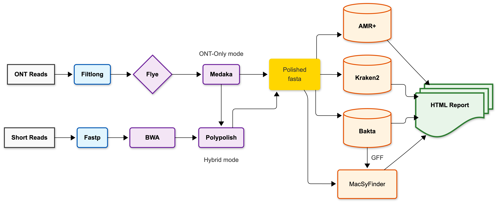
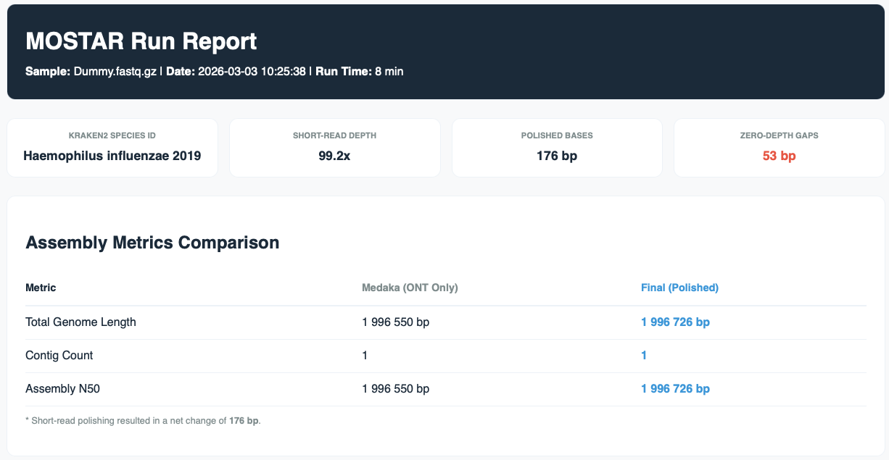
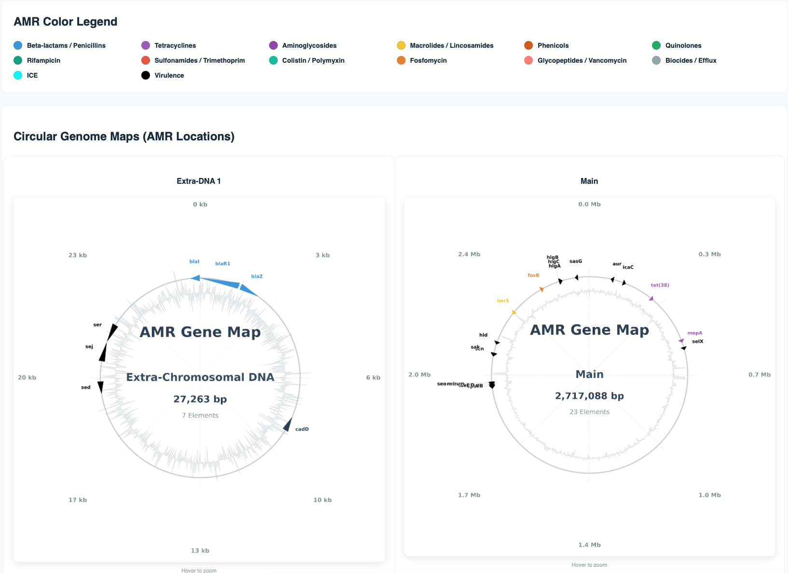
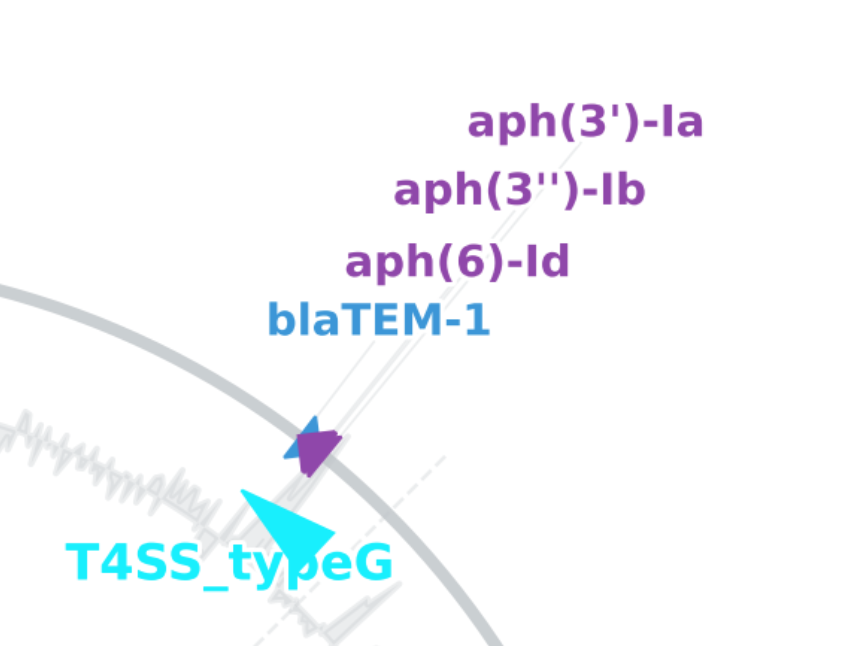
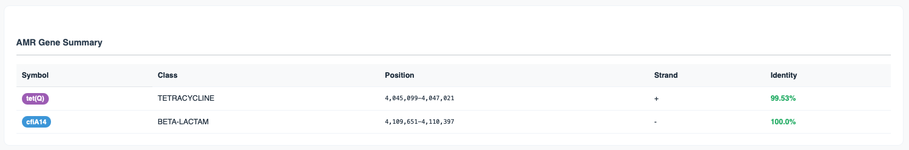

# MOSTAR - Modular ONT-Short-read Taxonomic Assembly and Resistome-Evolution pipeline

  

  
  
  

MOSTAR is comprehensive and complete bioinformatics pipeline for downstream analysis of whole-genome Oxford Nanopore sequencing data (ONT-reads). The pipeline constructs highly-polished genomes (using hybrid- or non-hybrid assembly), in addition to performing functional annotation, AMR profiling, ICE detection, and taxonomic classification — with built-in quality controls and an interactive HTML report. The name Mostar is inspired by the historic Stari Most (Old Bridge) of Mostar, a symbol of connection and cultural resilience.  

MOSTAR has been developed and tested on *S. aureus*, *B. fragilis*, as well as *H. influenzae* strains, but will work with any bacteria, as long as the correct genome size and ONT model are specified. The pipeline contains some of the most well known tools in bioinformatics, and is designed to be a "one-stop shop" for most bacterial analysis. Finaly the pipeline provides results and log files from every included tool. 

# Key features

#### Hybrid-Informed Quality Control
MOSTAR utilizes a short-read informed selection strategy. By leveraging Illumina data during the pre-processing phase, the pipeline prioritizes ONT reads with the highest k-mer consistency relative to high-accuracy short reads. This ensures the assembly begins with the most reliable long-read subset possible.

#### Automated Parameterization
To remove the bottleneck of manual configuration, the pipeline automates the transition from taxonomic classification to deep profiling. Once the species is identified, the corresponding NCBI-AMRFinder+ point-mutation model for that specific organism is automatically loaded, ensuring precision without manual intervention.

#### Mapping Genomic Plasticity
By integrating NCBI AMRFinder+ with MacSyFinder (ICE), the pipeline identifies the physical location of resistance elements. Distinguishing between fixed chromosomal resistance and highly mobile Integrative Conjugative Elements (ICE) enables a more accurate assessment of horizontal gene transfer (HGT) risks within institutional environments.

### Workflow

  

    
  

## Run modes  

#### ONT-only mode:
* Long-read quality trimming 
* De-novo assembly
* Long-read consensus correction
* AMR profiling
* Report

#### Hybrid mode - Additional steps if short-reads are provided:
* Short-read quality trimming
* Mapping short reads to consensus
* Polishing using supplied short-reads

#### Optional tools
* Taxonomic profiling  
* Functional annotation
* Integrative and Conjugative Elements (ICEs)

#### Output files
A successful run will contain the following output, including the final polished fasta, HTML-report, as well as individual output files and logs from all the included tools. 
<pre>
  Output_folder
  |- amr_results
  |- annotation
  |- flye
  |- ice_detection
  |- intermediate
  |- logs
  |- medaka
  |- taxonomy
  |- amr_summary.html
  |- MOSTAR_Final_Report.html
  |- MOSTAR_Assembly.fasta
</pre>
### Installation (Conda)
The installation has been designed to be as simple as possible. The included YML will create a separate environment with all the required dependencies. The only manual step is downloading and configuring databases. 

<pre>
# Clone the repository:
git clone https://github.com/nermze/MOSTAR.git

# Change dir:
cd MOSTAR

# Create a conda env with all dependencies from the provided yml:
conda env create -f environment.yml

# Activate the environment:
conda activate mostar-env

# Install using pip:
pip install . 

# Run MOSTAR and display help text
mostar -h
</pre>

#### Setup and download Databases
<pre> 
# Activate env (if not activated)
conda activate mostar-env 
  
# Download AMRFinder+ database: 
amrfinder -u

# Download bakta database (Specify light or full)
bakta_db download --output <output-path> --type [light|full]

# Download Kraken2 database
# To download the small pre-built db (any Kraken2 compatible DB will also work)
mkdir -p ~/kraken2_db && cd ~/kraken2_db
wget https://genome-idx.s3.amazonaws.com/kraken/k2_pluspf_08gb_20240904.tar.gz
tar -xvzf k2_pluspf_08gb_20240904.tar.gz
  
# Download standard EMU database
# The pipeline will auto-download the EMU-db if --emu-db is specified.
# If the automatic download fails, use the steps below
pip install osfclient
export EMU_DATABASE_DIR=<path_to_database>
cd ${EMU_DATABASE_DIR}
osf -p 56uf7 fetch osfstorage/emu-prebuilt/emu.tar
tar -xvf emu.tar
</pre> 

### Basic usage
<pre>
# Run MOSTAR in ONT-only mode: 
mostar --ont ont.fq.gz --genome-size [size] --output [dir] --model [model]

# Run MOSTAR in Hybrid mode:  
mostar --ont ont.fq.gz --genome-size [size] --output [dir] --model [model] --r1 R1.fq --r2 R2.fq 
  
# Include taxonomy (S1), annotations & ICE-detection:
mostar --ont ont_read.fastq.gz --r1 read1.fastq.gz --r2 read2.fastq.gz --genome-size 1.9m --output Output --kraken2-db kraken2_db_path --bakta-db db-light_path --ice 
  
# Note: If model is not specified, r1041_e82_400bps_sup_v5.2.0. is used. 
# Note: medaka tools list_models
# Note: ICE detection (--ice) requires functional annotation. You must provide a Bakta database (--bakta-db) for this module to run.
# Note: If --kraken2-db is provided, MOSTAR automatically identifies the species and configures the appropriate AMRFinder+ point-mutation model.
# Note: Organism can be specified manually using the --organism flag, leave empty if uncertain.
# Note: To view all supported organisms in NCBI AMRFinder+: amrfinder --list_organisms
</pre>  

### Command-Line Arguments
|   Required   |   Tool/Name  | Description |
| :-------| :---------| :--- |
| `--ont` | ONT Reads | Nanopore long-reads (.fastq.gz) |
| `--genome-size`  | Genome Size   | Estimated size (e.g., 2.1m, 500k) |
| `--output` | Output | Directory name for output files |
| `--model` | Model | Default: r1041_e82_400bps_sup_v5.2.0) |
| Options | |
| `--r1/--r2` | Illumina | Forward & Reverse short-reads (.fastq.gz) |
| `--organism` | AMRFinder+ | Organism (e.g., Escherichia, Staphylococcus) |
| `--meta` | Flye | Enable Meta-Genome mode, omit --genome-size [Default: disabled] |
| Annotation | |
| `--bakta-db` | Bakta | Path to Bakta database |
| `--bakta-ref` | Bakta | Annotation reference sequence (.gff) |
| `--complete` | Bakta | Enable if sequence is complete (circular) [Default: disabled] |
| ICE Detection | |
| `--ice` | MacSyFinder | Use with --bakta-db [Default: disabled] |
| Classification | |
| `--kraken-db` | Kraken2 | Requires path to pre-built Kraken2 database" |
| `--confidence` | Kraken2 | Kraken2 confidence threshold [Default: 0.1 |
| `--emu-db` | EMU | Requires EMU database path, auto-download [16s Amplicon classifier] |
| Other | |
| `--cleanup` | Cleanup | Delete intermediate files |
| `--threads` | Threads | Select number of threads |
| `--help/-h` | Help | Show help menu|
  

# Interactive HTML-report 
#### Species ID and QC-metrics for assembly
The report features key run-metrics, including assembly statistics and number of contigs. The report is dynamic and will adapt to user input, as some of the tools like taxonomy and short-read polishing are optional.  

  

#### Genome visualization
The report will also draw interactive genome maps, with visualizagion of AMR-gene locations, direction, detected ICE, and GC-content. 

  

#### Integrative Conjugative Elements (ICE)
If ICE detection has been enabled, the pipeline will extract coordinates from the annotation file, and display the results. 

  

#### AMR+ Summary Table
Finaly the report willl also feature a detailed AMR table.  

  

# Packages & Dependencies (installed by yml)
<pre>
1. Fastp
2. Flye
3. Medaka
4. BWA 
5. AMRFinder+
6. Bakta
7. Polypolish
8. Filtlong
9. Samtools
10. Minimap2
11. Kraken2
12. EMU
13. MacSyFinder 
</pre>  

# Troubleshooting and known issues
Q: Poor or fragmented assembly
A: Make sure to specify the correct expected genome size (--genome-size) and model (--model) example r1041.XX
 
Q: I have highly uneven data
A: Try running the pipeline with (--meta) 

Q. My exact model is not accepted 
A. you may need to downgrade medaka or install a specific version. You can do this by typing: conda install -c bioconda medaka=your_version, example medaka=2.2.0 

# Maintainer and author

Developed and maintained by **Nermin Zecic** ([@nermze](https://github.com/nermze)). 
For questions, bugs, or feature requests, please open an [Issue](https://github.com/nermze/mostar/issues).
